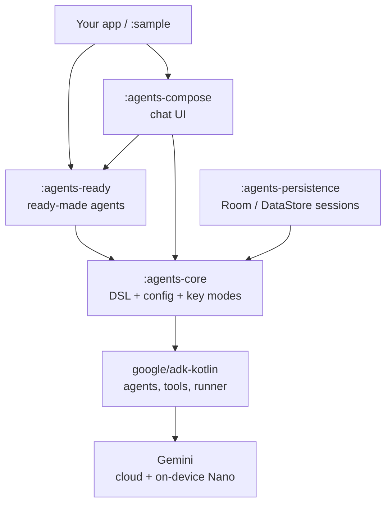

# Android AI Agents SDK — Vision, Architecture & Contributor Guide

_Maintainer: Anand Gaur • AI Mobile Coders_

## Vision — the one-line promise

Any Android developer should be able to add a production-ready AI agent to their app in about three lines of Kotlin: drop in a Gemini API key (or point it at a backend), pick a ready-made agent, and ship.

The SDK is a batteries-included, open-source layer that makes Google's Agent Development Kit (ADK) delightful to use on Android. It hides the boilerplate, ships ready-made agents, and gives Compose-first UI — so developers focus on their app, not on wiring up agent internals.

**Who it is for:** Android developers who want AI features (chat, summarize, translate, RAG, voice) without first learning agent frameworks, function-calling schemas, or session plumbing.

**Why now:** Google has just shipped ADK for Kotlin and ADK for Android, so the low-level primitives finally exist natively. But there is almost nothing above them — no ready agents, no UI, no persistence. Agents are becoming the next app primitive, and the developer-experience layer is wide open. That gap is exactly what this SDK fills.

## Why build on top of Google's ADK, not from scratch

Google now maintains an official [ADK for Kotlin and ADK for Android](https://developer.android.com/ai/adk) ([source repo](https://github.com/google/adk-kotlin)). It gives us the primitives for free: `LlmAgent`, `@Tool` annotations, `Runner`, `Session`, the `Gemini` model, multi-agent composition, agent-to-agent (A2A), and on-device Gemini Nano.

Building our own low-level framework would mean competing with Google and always lagging behind. Instead we build the **developer-experience layer above ADK** — amplifying it, never duplicating it.

Think of it as the OkHttp -> Retrofit relationship: ADK is the powerful engine; we are the clean, opinionated layer that makes it a joy to use.

| Concern | Google ADK (the engine) | Our SDK (the layer on top) |
| --- | --- | --- |
| Setup | Define tools, agent, runner, session, collect event stream | One builder call, sensible defaults |
| Ready-made agents | None | Chat, Summarizer, Translator, RAG, Voice, and more |
| UI | None | Compose components (`AgentChatScreen`) |
| Sessions | In-memory only | Persistent (Room / DataStore) |
| API key on Android | Restricted; you wire Firebase yourself | Dev + production modes behind one interface |
| Observability | Minimal | Logging and tracing hooks |

## What the SDK delivers — four pillars

Everything the SDK does ladders up to four promises. Each is a concrete module (see Architecture below).

1. **3-line agent DSL** — a clean Kotlin builder that hides ADK's tool/agent/runner/session boilerplate behind sensible defaults. Create and run an agent in one expression.
2. **Ready-made agents** — the flagship value. Import a `ChatAgent`, `SummarizerAgent`, or `RagAgent` and use it directly, no configuration required. This is what competitors do not offer.
3. **Multi-agent orchestration presets** — ready patterns on top of ADK's composition: a router agent that delegates, plus sequential and parallel pipelines, so multi-agent apps do not start from a blank page.
4. **Compose UI + persistence** — drop-in Compose components for chat and agent interaction, backed by persistent sessions (Room / DataStore) that survive app restarts — both gaps in raw ADK.

## Developer experience

The whole point is to collapse ADK's setup into a single readable expression.

**Raw ADK today** — define tools, build the agent, build a runner, build a session service, then collect an event stream:

```kotlin
val agent = LlmAgent(
    name = "assistant",
    model = Gemini(name = "gemini-flash-latest", apiKey = key),
    instruction = Instruction("You are a helpful assistant."),
    tools = TimeService().generatedTools(),
)
val runner = InMemoryRunner(agent, InMemorySessionService())
runner.runAsync(userId, sessionId, Content(Role.USER, listOf(Part(text = input))))
    .collect { event -> /* handle */ }
```

**With our SDK** — the same result, ready to use:

```kotlin
val agent = ChatAgent(apiKey = key)          // ready-made
val reply = agent.send("Hello!")             // suspend fun, done
```

### Two API-key modes behind one interface

Be honest with developers: shipping a raw Gemini API key inside a published APK is a security risk — anyone can decompile the app and extract it. Google's own Android SDK restricts direct key use for this reason. The SDK supports both modes cleanly:

| Mode | How the key is provided | Use it for |
| --- | --- | --- |
| Dev / prototype | Raw Gemini API key, with a loud runtime warning | Hackathons, demos, learning, internal builds |
| Production | Firebase AI Logic or a backend proxy — key stays server-side | Published apps on the Play Store |

Switching between them should be a one-line config change, so beginners start instantly and teams ship safely.

## Architecture & modules

The SDK is a small stack of focused Gradle modules, each a clean layer over `google/adk-kotlin`. A developer depends only on the modules they need.



- **:agents-core** — the thin convenience layer: the agent DSL/builder, configuration, and the dev/production key modes. Everything else builds on it.
- **:agents-ready** — the ready-made agent catalog (see next section).
- **:agents-compose** — Jetpack Compose UI: `AgentChatScreen`, message list, input bar, streaming indicators.
- **:agents-persistence** — durable sessions and history via Room / DataStore, implementing ADK's session interface.
- **:sample** — the demo app that showcases every feature (this is the current `:app` module, repurposed).

A guiding rule: `:agents-core` stays dependency-light and API-stable, because every other module and every user app rests on it.

## Ready-made agents catalog

The flagship feature: an agent you import and use in one call. All agents below are planned; the catalog grows over time and is the easiest area for contributors to own one agent each.

| Agent | What it does | One-liner |
| --- | --- | --- |
| `ChatAgent` | General conversational assistant | `ChatAgent(apiKey).send("Hi")` |
| `SummarizerAgent` | Summarize long text or documents | `SummarizerAgent(apiKey).summarize(text)` |
| `TranslatorAgent` | Translate between languages | `TranslatorAgent(apiKey).translate(text, to = "hi")` |
| `RagAgent` | Answer over your own documents (retrieval) | `RagAgent(apiKey, store).ask(q)` |
| `VisionAgent` | Understand images and screenshots | `VisionAgent(apiKey).describe(bitmap)` |
| `VoiceAgent` | Speech-to-text, respond, text-to-speech | `VoiceAgent(apiKey).listen()` |
| `ToolAgent` | Call your own functions via function-calling | `ToolAgent(apiKey, tools).run(input)` |
| `RouterAgent` | Multi-agent: route a query to the right sub-agent | `RouterAgent(listOf(a, b, c)).handle(q)` |

Each agent is a thin, well-tested preset over `:agents-core` — opinionated defaults, sensible prompts, and clear extension points for developers who want to customize.

## Roadmap

Ship in thin, working slices. Each milestone ends with something a developer can actually run.

| Version | Focus | Key deliverables |
| --- | --- | --- |
| v0.1 | Skeleton + proof of concept | `:agents-core` module on `adk-kotlin`, the 3-line DSL, a working `ChatAgent`, `:sample` demo |
| v0.2 | Agent catalog | `SummarizerAgent`, `TranslatorAgent`, `ToolAgent`; dev/production key modes |
| v0.3 | UI + persistence | `:agents-compose` chat components, `:agents-persistence` Room sessions |
| v0.4 | Multi-agent | `RouterAgent`, sequential/parallel pipelines; `RagAgent`, `VisionAgent` |
| v0.5 | Hardening | Observability hooks, error/retry patterns, full test coverage, docs site |
| v1.0 | Stable release | Frozen public API, `VoiceAgent`, published to Maven Central |

After v1.0: KMP exploration (iOS/desktop), more agents, and community-contributed presets.

## Contributing — workstreams for our contributors

Contributions are organized into parallel, independent workstreams so nobody blocks anyone else. Each maps to a module and can start as soon as v0.1's skeleton lands. Pick one workstream to own; small tasks inside it become good-first-issues.

| Workstream | Owns | Good first issues | Skills |
| --- | --- | --- | --- |
| Core & DSL | `:agents-core` | Add a builder option, improve defaults | Kotlin, coroutines, API design |
| Ready-made agents | `:agents-ready` | Build one new agent end to end | Kotlin, prompt design |
| Compose UI | `:agents-compose` | A message bubble, streaming indicator | Jetpack Compose |
| Persistence | `:agents-persistence` | Room entity, session DAO | Room / DataStore |
| Docs & samples | `README`, `:sample` | Write a how-to, add a demo screen | Writing, Android basics |
| Testing & CI | all modules | Unit test an agent, set up GitHub Actions | JUnit, Turbine, CI |

**How to start:** each workstream gets a tracking issue and a `good-first-issue` label. A new contributor comments to claim a task, forks, and opens a PR against `main`.

**Conventions:** see [CONTRIBUTING.md](../CONTRIBUTING.md) — feature branches + PRs, `ktlint`/`detekt` for style, tests required for new agents, and Apache 2.0 license with a Developer Certificate of Origin sign-off.

**Communication:** coordinate through the AI Mobile Coders community — a dedicated channel for the SDK, plus a short weekly async update so everyone stays in sync without meetings.

## Tech stack & engineering standards

Standards chosen so a world-class SDK stays trustworthy long-term.

- **Language & UI:** Kotlin, Jetpack Compose-first for all UI.
- **Support:** `minSdk 24`, JVM toolchain 17, aligned with `adk-kotlin` requirements.
- **Async:** Kotlin coroutines and `Flow` for streaming responses.
- **Testing:** JUnit for logic, Turbine for `Flow`, and instrumented tests for Compose; new agents ship with tests.
- **Quality gates:** `ktlint` + `detekt` and CI (GitHub Actions) green before merge.
- **Versioning:** strict semantic versioning — the public API of `:agents-core` is a contract, breaking changes only on majors.
- **Publishing:** Maven Central from v1.0, so `implementation("...")` just works.
- **License:** Apache 2.0 (standard for Android libraries and friendly to adopters).
- **Long-term:** design core abstractions to be Kotlin Multiplatform-ready, keeping the door open to iOS and desktop later.

North-star principle for every decision: easy for beginners, safe for production, and never a fork of Google's ADK — always a clean layer above it.
